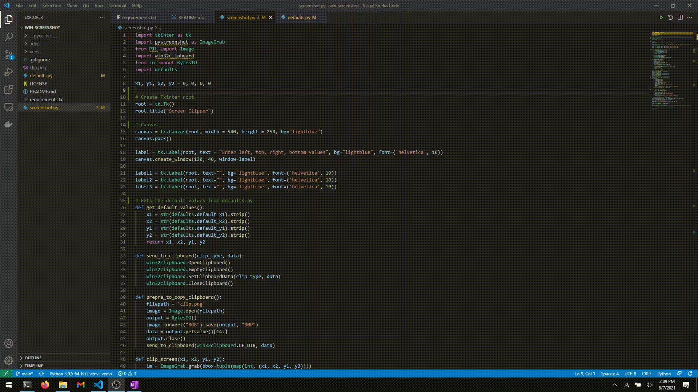

<h3 align="center">Windows Screen Clipper</h3>

---

 Windows Screenshot utility built using Tkinter
      

## 📝 Table of Contents

- [About](#about)
- [Prerequsites](#prerequisites)
- [Running the project](#run)
- [Demo](#demo)
- [Built Using](#built_using)
- [Authors](#authors)

## 🧐 About 

The Utility supports taking screenshots by specifying the region and copying them to clipboard.
It can also be configured to show the screenshot to user after clipping.

### Prerequisites 

This project requies python and pip.

To run the project, install the pip pacakges using `pip install -r requirements.txt`

### Running the project 

to run the project, `python screenshot.py` or `python3 screenshot.py`

### Demo 

## ⛏️ Built Using 

- [Python](https://www.python.org/) - Language
- [Tkinter](https://docs.python.org/3/library/tkinter.html) - GUI Framework

## ✍️ Authors 

- [@cksidharthan](https://github.com/cksidharthan) - Idea & Initial work